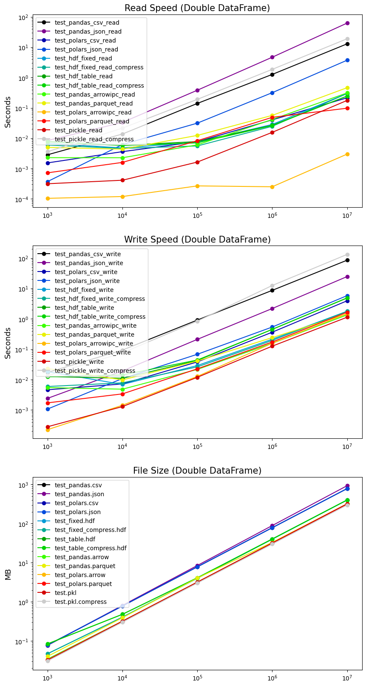

Python Performance Benchmark
============================

This repository is Python benchmark for common usage in data science.

Forked from: https://github.com/lintseju/python_performance_benchmark

Pandas I/O
----------

Data: n row x 4 columns random double dataframe.

Remark:
- time or size (Y axis) in log scale.
- Maximum row for excel output is 1048575 rows, so file size and read 
speed of 10^7 are underestimated.
